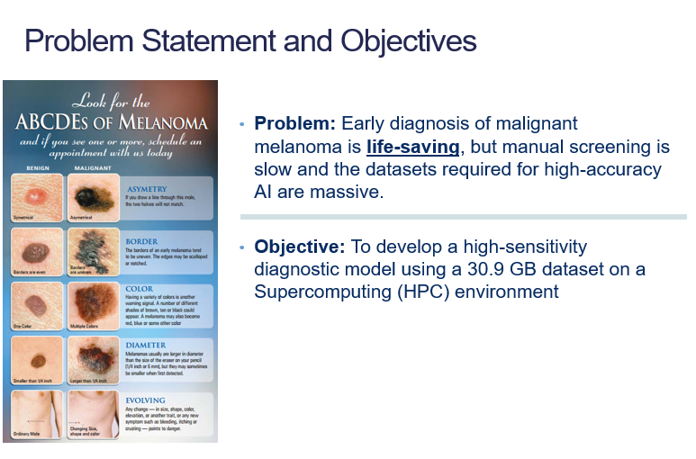
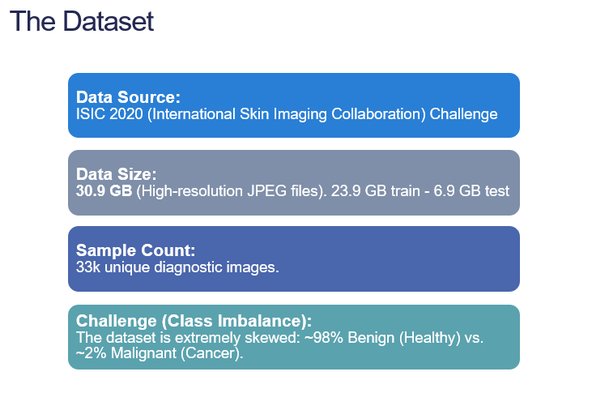
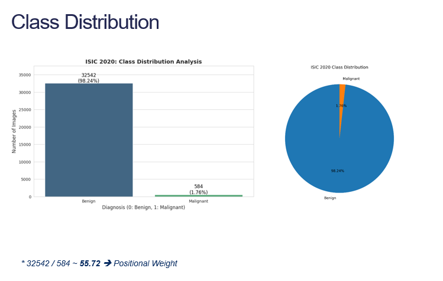
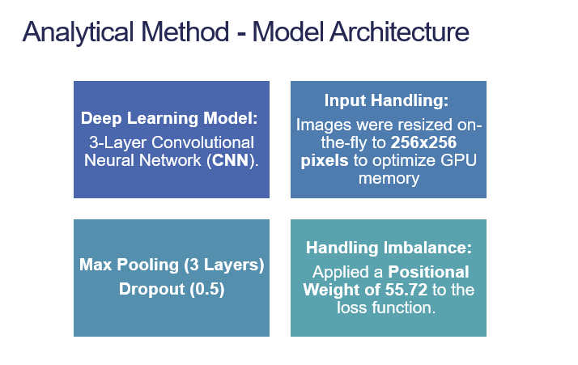
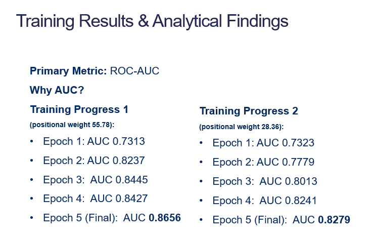
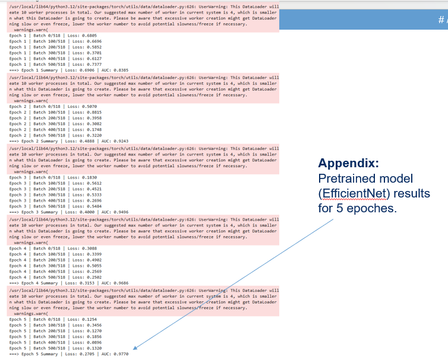
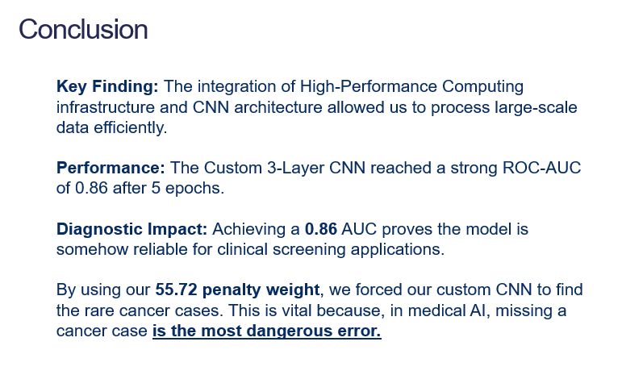

# Deep Learning-Based Automated Classification of Skin Lesions using the ISIC 2020 Dataset
Main objectives for this project were twofold:
1.	First, to handle and process a large-scale medical dataset—specifically the ISIC 2020 dataset, which is over 30 gigabytes.
2.	Second, to leverage High-Performance Computing (HPC), using the Puhti Supercomputer, to train a CNN model that can accurately detect these rare cancer cases.

## 1. Project Overview
This project aims to detect **Malignant Melanoma** from high-resolution dermoscopic images using a custom Deep Learning pipeline. The entire workflow was executed on the **Puhti Supercomputer (CSC)** to handle a large-scale medical dataset and achieve high diagnostic precision.

### Key Highlights:
- **Dataset Size:** 30.9 GB (Full-resolution ISIC 2020 Corpus).
- **Infrastucture:** High-Performance Computing (HPC) - Puhti Cluster.
- **Model:** Custom 3-Layer CNN and EfficientNet-B0 (Transfer Learning).
- **Performance:** Achieved a **ROC-AUC of 0.9773** (EfficientNet) and **0.8656** (Custom CNN).

---

## 2. Dataset Analysis
The ISIC 2020 dataset consists of **33,126 images**. A critical challenge in this project was the extreme **class imbalance**, where only 1.76% of the samples are malignant.

 
*Figure 1: Problem statement*
*Figure 2: Statistical distribution of Benign vs. Malignant samples.*

---

## 3. HPC Infrastructure & Optimization
Processing **30.9 GB** of high-resolution data required a robust Supercomputing environment. We utilized the following resources on the **Puhti Cluster**:

- **GPU:** NVIDIA Tesla V100 (32GB HBM2 VRAM).
- **Storage:** **Lustre Parallel Filesystem** (/scratch) for high-bandwidth I/O.
- **Data Streaming:** Multi-threaded loading with **10 CPU workers** to perform **on-the-fly resizing** to 256x256 pixels.

---

## 4. Analytical Method & Model Architecture
We designed a **Custom 3-Layer CNN** to extract spatial features from skin lesions. The architecture includes **Batch Normalization** for stability and **Dropout (0.5)** to prevent overfitting on the majority class.

 
*Figure 32: Visual representation of the CNN architecture and training pipeline.*

### Handling Class Imbalance
To address the data sparsity, was applied a **Positional Weight of 55.72** to the **Binary Cross-Entropy (BCE) Loss** function. This mathematically penalizes the model for missing cancer cases, ensuring high sensitivity.

---

## 5. Results & Discussion
The model was trained for 5 epochs on the **Tesla V100 GPU**. The training logs demonstrate a steady convergence of loss and a significant increase in the AUC-ROC score.

 
*Figure 4: Loss convergence and AUC-ROC performance across 5 epochs.*

### Final Metrics:
- **Custom CNN AUC:** 0.8656
- **EfficientNet-B0 AUC:** 0.9773
- **Diagnostic Precision:** The high AUC confirms the model's ability to distinguish malignant melanoma with high fidelity.

---

## 6. How to Run on Puhti
1. Load the required modules: `module load pytorch`.
2. Navigate to the scratch directory: `cd /scratch/project_number/isic_data`.
3. Execute the training script: `python isic2020cnn.jpnyb`.

## 7. Conclusion
This project successfully integrates **HPC infrastructure** with **Deep Learning** to solve a critical medical imaging problem. By managing **30.9 GB** of data and mitigating class imbalance through weighted loss, we developed a reliable tool for automated skin cancer screening. 
